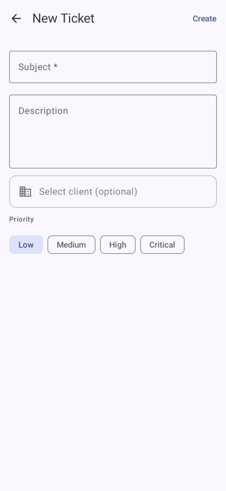
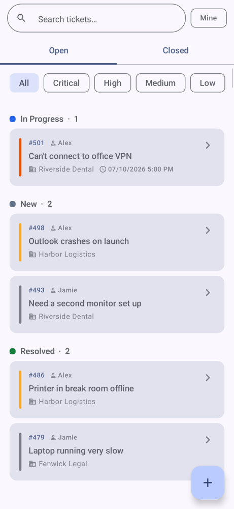
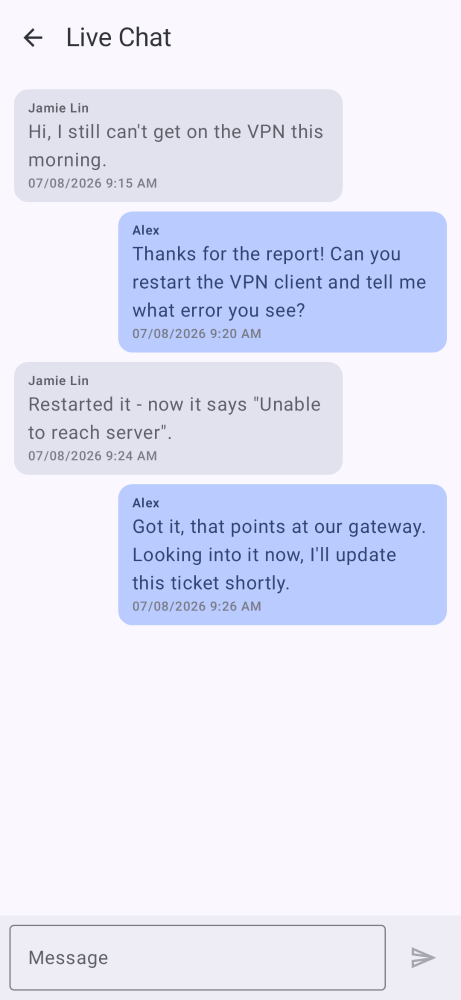

# ITFlow MSP — Android App

> **By [TractorHacker](https://github.com/TheTractorHacker)** — the native Android companion for [ITFlow MSP Edition](https://github.com/TheTractorHacker/itflow).
> This is **not** the official ITFlow app and is not affiliated with or endorsed by ITFlow LLC.

Built with Kotlin + Jetpack Compose + Material 3.

---

## Screenshots

<table>
<tr>
<td align="center" width="34%"><b>New Ticket</b></td>
<td align="center" width="33%"><b>Tickets</b></td>
<td align="center" width="33%"><b>Live Chat</b></td>
</tr>
<tr>
<td></td>
<td></td>
<td></td>
</tr>
</table>

---

## Features

- **Dashboard** — open ticket counts, recent activity, and system alerts at a glance
- **Tickets** — view, reply, change status, assign technicians, and add time charges
- **Assets** — browse client assets with full detail view; scan barcodes and QR codes to look up assets instantly
- **Clients** — full client list with contacts, locations, credentials, and contracts
- **Worksheets** — view and fill out worksheet responses from your phone
- **Global Search** — search across tickets, clients, and assets in one place
- **Push Notifications** — get notified on new tickets and assignments via Firebase
- **Appointments** — view and manage scheduled on-site and remote appointments

---

## Requirements

- Android Studio Hedgehog or newer
- Android SDK 35
- **ITFlow MSP Edition** server running **v2.4.12+** ([TheTractorHacker/itflow](https://github.com/TheTractorHacker/itflow))
- `google-services.json` from your Firebase project for push notifications

---

## Setup

1. Clone the repo and open in Android Studio
2. Add your `google-services.json` to `app/`
3. Run the app — enter your ITFlow server URL on first launch
4. Log in with your ITFlow technician credentials

---

## Branches

| Branch | Purpose |
|--------|---------|
| `beta` | Active development — new features land here first |
| `release` | Stable builds only |

---

## Related

- Web app: [TheTractorHacker/itflow](https://github.com/TheTractorHacker/itflow)
- Upstream ITFlow: [itflow-org/itflow](https://github.com/itflow-org/itflow)
